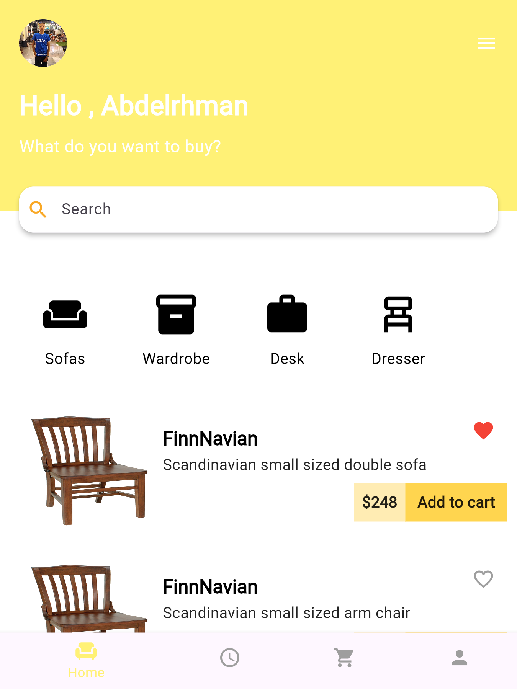

## 📱 Features

- Category list with icons.
- Product card UI with:
  - Image
  - Product name
  - Price and Add to Cart button split view
- Interactive mouse hover effects (Pointer cursor)
- Responsive UI


## 📁 Project Structure

```
lib/
├── main.dart              # Entry point of the application
├── pages/
│   └── home_screen.dart   # Main UI layout with product listing
├── widgets/
│   ├── category_list.dart # Category horizontal list widget
│   └── product_card.dart  # Product item card widget
└── theme/
    └── app_theme.dart     # Theme configuration file
```

## 🎨 Theme

Custom light theme defined in `app_theme.dart` with a yellow primary color (`#FFF176`), black text, and white background.

## 🖼️ Screenshot

> Place your screenshot here and name it something like `screenshot.png` in the root folder.

```

```


Made with ❤️ in Flutter.
