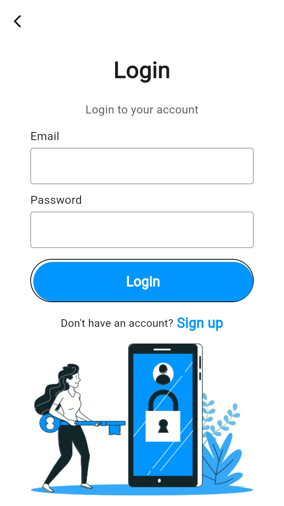
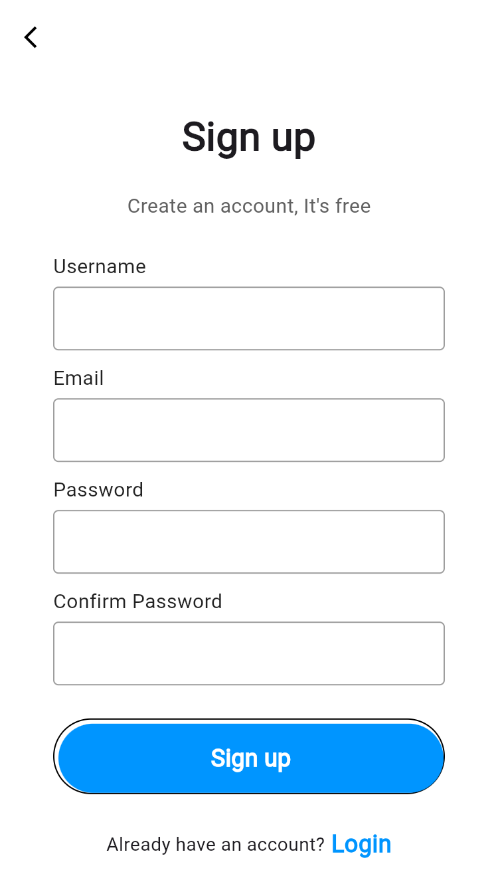
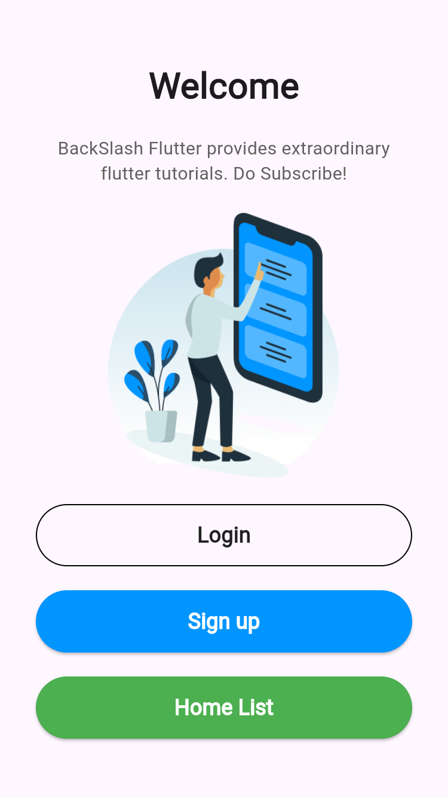
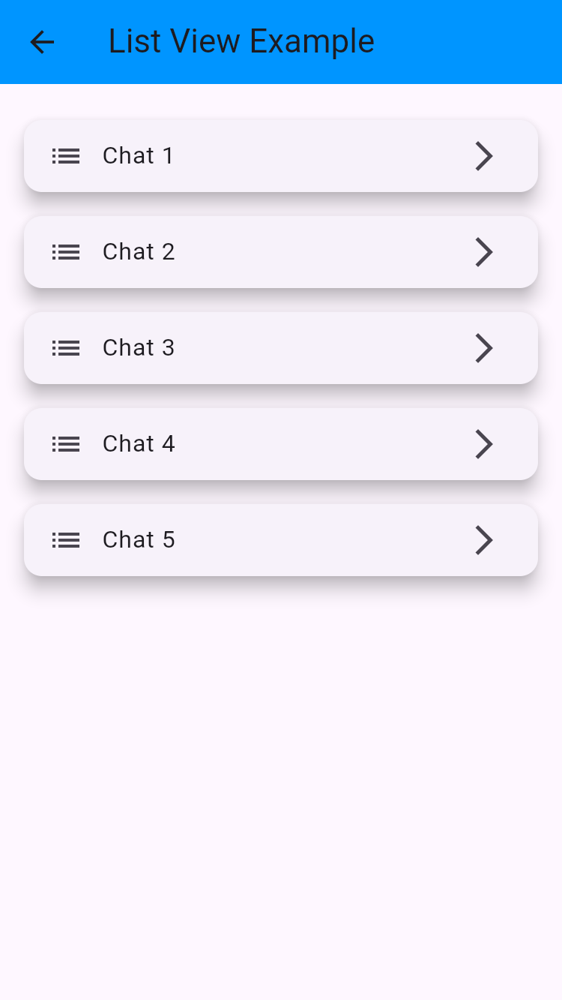

# Flutter Simple Login Project

This is a basic Flutter project that demonstrates simple navigation, user interface structure, and the use of several core widgets like `ListView`, `Navigator`, and hover effects.

## 💡 Features

- 🧭 Navigation using named routes (`Navigator.pushNamed`)
- 🧍 Login and Signup screens
- 🏠 Home screen with buttons to navigate between pages
- 🖱️ Hover effect on clickable text (like `Login` / `Sign Up`)
- 📜 A separate screen with `ListView` to show basic list usage

## 🛠️ Widgets & Concepts Used

- `MaterialApp`, `Scaffold`, `Text`, `TextField`, `ElevatedButton`
- `MouseRegion` for hover effects
- `Navigator` with named routes
- `ListView` for displaying lists
- Custom colors and UI elements

## 📸 Screenshots

Below are four screenshots showing the functionality of the app:







## 🚀 How to Run

```bash
flutter pub get
flutter run -d chrome  # or your desired device
```

## 📁 Structure

```
lib/
├── main.dart         # Entry point with route setup
├── login.dart        # Login screen
├── signup.dart       # Signup screen
├── home.dart         # Home screen with navigation buttons
└── list_screen.dart  # Screen using ListView
```

---

This app is designed for learning purposes. You can build upon it and expand it for real-world use.
