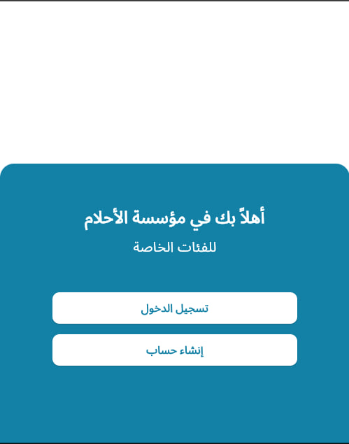
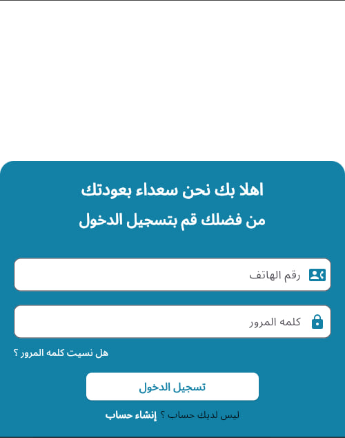
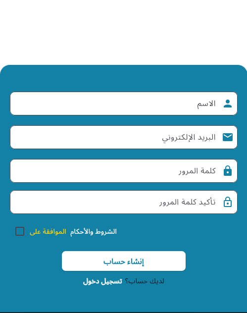

This project is a Flutter application that includes:
- A **Welcome Screen** with an image and blue container.
- A **Login Screen** with email and password fields.
- A **Signup Screen** with confirm password and checkbox functionality.

## 📱 Screens Overview

### 1. Welcome Screen
- Displays an image in the white area at the top.
- Blue container at the bottom with navigation buttons.
- Uses `WelcomeScreenContent` for internal content.

### 2. Login Screen
- Two input fields: Email and Password.
- "Forgot Password" option.
- Login button and navigation to SignUp screen.

### 3. SignUp Screen
- Input fields: Name, Email, Password, Confirm Password.
- Checkbox for accepting terms and conditions.
- Signup button and navigation to Login screen.

---

---

## 🎨 Design Notes

- Color palette is managed through `app_colors.dart`.
- Text strings like button labels are organized in `app_strings.dart`.
- Layout is responsive using `MediaQuery` and `Expanded`.

---

## 📸 Screenshot

