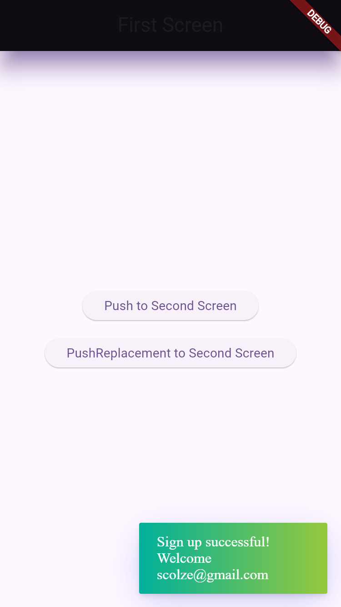

---

## Project Structure

### 1. `sign_up_bloc.dart`
- Contains:
  - **Events** such as `SignUpSubmittedEvent`, `SignUpReset`, and `InitiSingUpScreenEvent`.
  - **States** such as `SignUpInitial`, `SignUpLoading`, `SignUpSuccess`, `SignUpFailure`.
  - The bloc logic that handles events, validates data via the validator, and emits the appropriate states.

### 2. `form_validator.dart`
- The `SignUpValidator` class handles input validation.
- Includes methods:
  - `validateEmail(String?)` — Checks if the email is not empty and matches a valid pattern.
  - `validatePassword(String?)` — Checks if the password is not empty and has at least 6 characters.
  - `validateConfirmPassword(String?, String?)` — Checks if the confirm password matches the password.
  - `validateSignUpFields(...)` — Validates all fields and returns a map (`Map<String, String>`) of field-specific errors.

### 3. `sing_up_screen_whith_bloc.dart`
- The UI screen containing the sign-up form.
- Uses `BlocProvider` and `BlocConsumer` to listen and react to bloc states.
- Displays error messages using `Fluttertoast` on failure.
- Shows a loading indicator during processing.
- Navigates to the first screen upon successful sign-up.

---

## How Validation Works

- When the user taps the "Sign Up" button, the input fields are validated using the validator.
- If there are validation errors for any fields (email, password, confirm password), a `SignUpValidationErrors` state is emitted containing all errors.
- The UI listens to this state and shows the first error message in a Toast.
- If all inputs are valid, the bloc emits a `SignUpLoading` state, then after a simulated delay, emits either `SignUpSuccess` or `SignUpFailure` (e.g., if the email is already in use).

---

## Core Validator Code

```dart
class SignUpValidator {
  static String? validateEmail(String? email) {
    if (email == null || email.isEmpty) {
      return 'Email is required';
    }
    if (!RegExp(r'^[\w-\.]+@([\w-]+\.)+[\w-]{2,4}\$').hasMatch(email)) {
      return 'Please enter a valid email';
    }
    return null;
  }

  static String? validatePassword(String? password) {
    if (password == null || password.isEmpty) {
      return 'Password is required';
    }
    if (password.length < 6) {
      return 'Password must be at least 6 characters';
    }
    return null;
  }

  static String? validateConfirmPassword(String? password, String? confirmPassword) {
    if (confirmPassword == null || confirmPassword.isEmpty) {
      return 'Please confirm your password';
    }
    if (password != confirmPassword) {
      return 'Passwords do not match';
    }
    return null;
  }

  static Map<String, String> validateSignUpFields({
    required String email,
    required String password,
    required String confirmPassword,
  }) {
    final errors = <String, String>{};

    if (email.isEmpty) {
      errors['email'] = 'Email is required';
    } else if (!RegExp(r'^[\w-\.]+@([\w-]+\.)+[\w-]{2,4}\$').hasMatch(email)) {
      errors['email'] = 'Please enter a valid email';
    }

    if (password.isEmpty) {
      errors['password'] = 'Password is required';
    } else if (password.length < 6) {
      errors['password'] = 'Password must be at least 6 characters';
    }

    if (confirmPassword.isEmpty) {
      errors['confirmPassword'] = 'Please confirm your password';
    } else if (password != confirmPassword) {
      errors['confirmPassword'] = 'Passwords do not match';
    }

    return errors;
  }
}
```

---

## Summary

- The project uses **BLoC** to separate business logic from UI.
- Input validation is centralized in the `SignUpValidator` class.
- Bloc states represent different stages of sign-up: initial, loading, success, failure, and validation errors.
- The UI interacts with the bloc using `BlocConsumer` and clearly displays error messages to the user.
- Validation is performed before submitting data for processing.

---



